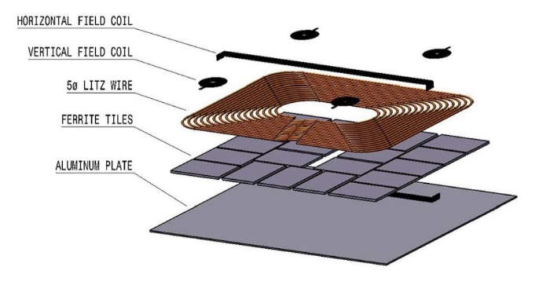

# Simulation of Dynamic Wireless Charging Roads in NYC
> This is a research project created for the New York Institute of Technology Undergraduate Research and Entrepreneurship Program (UREP), for the 2025 academic year.
>
> Contributors: Dr. Ziqian (Cecilia) Dong, Ziad Ghanem, Daniel Chung, and Luis Jaco

# Table of Contents
1. [Overview](#overview)
2. [Background](#background)
3. [Cost Analysis](#cost-analysis)
4. [Simulation](#simulation)
   
    4a. [Simulation #1: All-Traffic Scenario](#simulation-1-all-traffic-scenario)
   
    4b. [Simulation #2: 42nd St Scenario](#simulation-2-42nd-st-scenario)
6. [Charge Gain Analysis](#charge-gain-analysis)
7. [Conclusion](#conclusion)
8. [References](#references)

## Overview
The number of EVs on the road in the U.S. is projected to be roughly 78.5 million by 2035, up from 
4.5 million in 2023. This increase in EVs demands a larger number of stationary wired chargers 
to meet the charging demands. Based on 2035 projections, 42.2 million wired chargers would be 
required. Chargers occupy valuable urban space and add traffic congestion around charging stations.
In this study, the potential of dynamic wireless power transfer (DWPT) within New York City is 
analyzed. To demonstrate and evaluate this system, our research team developed a simulation in order
to find trip times spent in NYC, under varying levels of traffic. This data is then leveraged 
to calculate potential charge gain, in a scenario where DWPT lanes are deployed along the city. 

## Background
In 2025, the rising popularity of electric vehicles (EVs) will bring new challenges, mainly
electricity costs; which can raise drastically during peak usage hours. Urban areas like Manhattan
have many added difficulties due to limited space for public chargers, actively forcing drivers to
travel out of their way just to find available EV charging stations. 

The SAE J2954 standard is a dynamic charging system which allows EVs to charge wirelessly while
moving or idling. Under this standard, we evaluate and analyze the performance-cost tradeoffs of
multiple different coil configurations: Dual Receiver DD (Dual WPT-3), Segmented DDQ WPT-3, and
Large Single Coil WPT-4.

  
   
  <em>Ground Assembly structure defined by the SAE J2954 Standard</em>

## Cost Analysis 
We compare the cost impact of three wireless EV charging coil configurations, the WPT-3 (DD), 
Dual WPT-3 (DDQ), and the Large Single Coil WPT-4, based on their size and quantity per mile. Both 
the DD and DDQ systems use one-meter coils, requiring 1609 units per lane and posting between 
\$482,700–\$965,400 and \$563,150–\$1,120,000, respectively. In contrast, the Large Single Coil spans 2 
meters, needing on only 805 units per mile, reducing the cost to \$322,000–\$644,000 per lane.

| Design Type      | Coil Size | Coils per Mile | Cost per Coil (Low–High) | Cost per Mile (Low–High)  | Power Class |
|------------------|----------|----------------|---------------------------|---------------------------|-------------|
| WPT3 (DD)        | 1 Meter  | 1609           | \$300–\$600               | \$482,700–\$965,400       | 11kW        |
| WPT3 (DDQ)       | 1 Meter  | 1609           | \$350–\$700               | \$563,150–\$1,120,000     | 11kW        |
| WPT4             | 2 Meters | 805            | \$400–\$800               | \$322,000–\$644,000       | 22kW        |

## Simulation
[SUMO](https://github.com/eclipse-sumo/sumo) is an open-source and continuous multi-modal traffic 
simulation application designed to handle large networks. We use SUMO to conduct simulations of 
vehicles driving throughout New York City under various traffic conditions. This data gives us 
valuable information that can be used to calculate dwell time over DWPT lanes, and net charge gain.

### Simulation #1: All-Traffic Scenario
Using SUMO, we designed and implemented various real-world traffic scenarios in order to calculate 
trip times for vehicles driving within New York City. This allows us to gain a working understanding
of the potential dwell time spent within a drive.

  
   
  <em>Simulated New York City area (Midtown Manhattan)</em>

  
   
  <em>Histogram of trip times under low traffic scenario</em>

  
   
  <em>Histogram of trip times under high traffic scenario</em>

### Simulation #2: 42nd St Scenario
After performing domain-specific research, our team deduced that the most optimal road to implement 
DWPT lanes would be 42nd St:
- Iconic 2.2-mile spine (East River → Hudson) – links UN HQ, Grand Central, Bryant Park, Times Square & Port Authority.
- Heavy but slow traffic – M42 averages ≈ 3 mph (NYC’s slowest bus) yet carries ≈ 70k riders/day.
- DWPT sweet spot: low speeds ⇒ long dwell over coils → max energy pick-up.

We iterated on our previous simulation. Simulating medium traffic throughout the city, however, only
tracking the trip times of vehicles who had traveled across the entirety of 42nd St.

  
   
  <em>NYC with targeted 42nd St</em>

  
   
  <em>5th Ave & E 42nd St under medium traffic</em>

  
   
  <em>Histogram of trip times spent among vehicles which crossed 42nd St</em>

## Charge Gain Analysis
Utilizing our 42nd St simulation, we obtain an average trip time of 40.64 minutes to drive across
42nd St under medium-level traffic. With this statistic, we can calculate the net charge gain within
a DWPT road scenario. We calculate net gain on the two power classes seen in our previously 
mentioned wireless coil configurations, WPT-3 (particularly DD) and WPT-4.

| Vehicle            | WPT-3 (DD) | WPT-4 |
|--------------------|----------|------|
| Tesla Model 3      | 2.59 kW  | 6.04 kW |
| Nissan Leaf        | 2.52 kW  | 5.96 kW |
| Ford Mach-E        | 2.25 kW  | 5.69 kW |

## Conclusion
Continuous DWPT lanes can fully offset—and at 22kW (WPT-4)—even exceed the energy used on typical 
5-20-mile Midtown trips, enabling energy-neutral commuting without changes in driver behavior. 
Because charging happens in-lane, DWPT frees valuable curb space and avoids congestion linked to the 
tens of millions of wired chargers forecasted for 2035. Using the SAE J2954 WPT-3/WPT-4 standards 
ensures fleet-wide compatibility, while cost modeling shows lane energy prices rival curbside DC 
fast charging when amortized over 15 years. Targeted deployment along high-traffic corridors
positions New York City to lead the next wave of seamless, in-motion EV charging infrastructure.

### References
[1]: SAE J2954-2020: “Wireless Power Transfer for Light-Duty Plug-in/Electric
Vehicles and Alignment Methodology.” Society of Automotive Engineers, 2020.

[2]: J. Kim et al., “Review of static and dynamic wireless EV charging systems,”
Renew. Sust. Energy Rev., vol. 104, pp. 14-29, 2019.

[3]: EPA. Green Vehicle Guide [Web resource]. U.S. Environmental Protection
Agency, 2025. Available online: https://www.epa.gov/greenvehicles.

[4]: Satterfield, C., Schefter, K., & Maiorana, J. (2024, October). Electric
Vehicle Sales and the Charging Infrastructure Required Through 2035. Edison
Electric Institute

[5]: Guangyu Lin et al., "Robustness analysis on electric vehicle energy
distribution networks," 2013 IEEE Power & Energy Society General Meeting,
Vancouver, BC, Canada, 2013, pp. 1-5, doi: 10.1109/PESMG.2013.6672098.

### License
[MIT](https://choosealicense.com/licenses/mit/)
